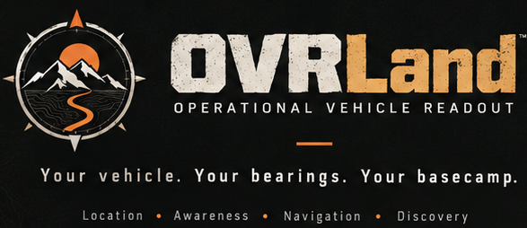
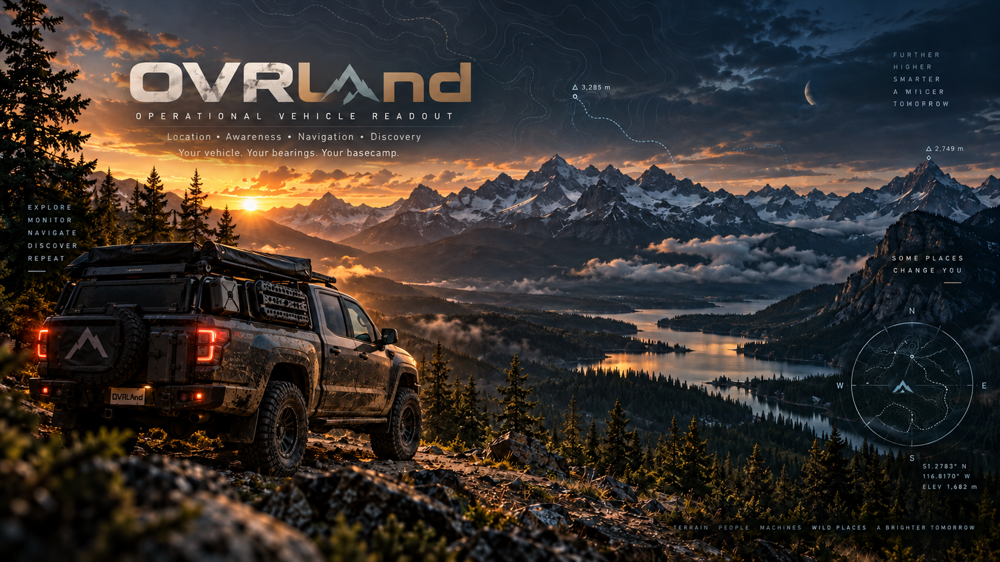
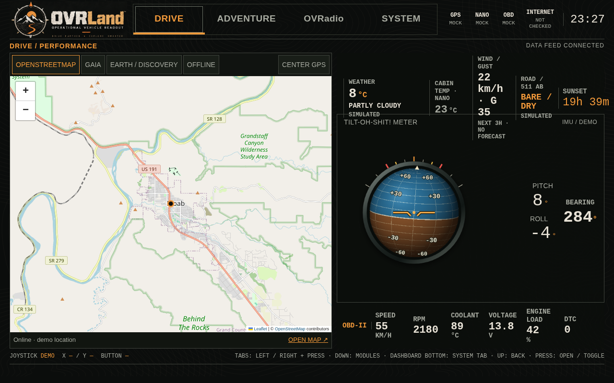
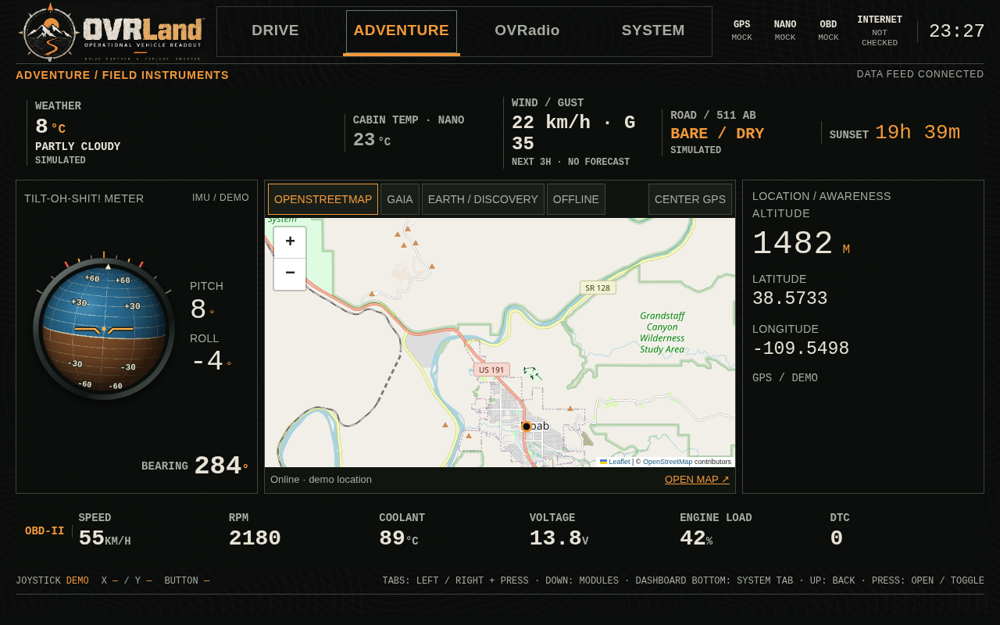
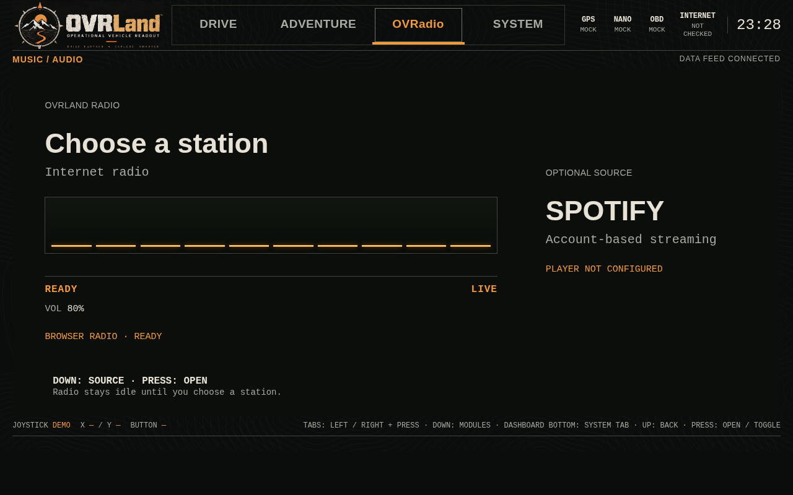
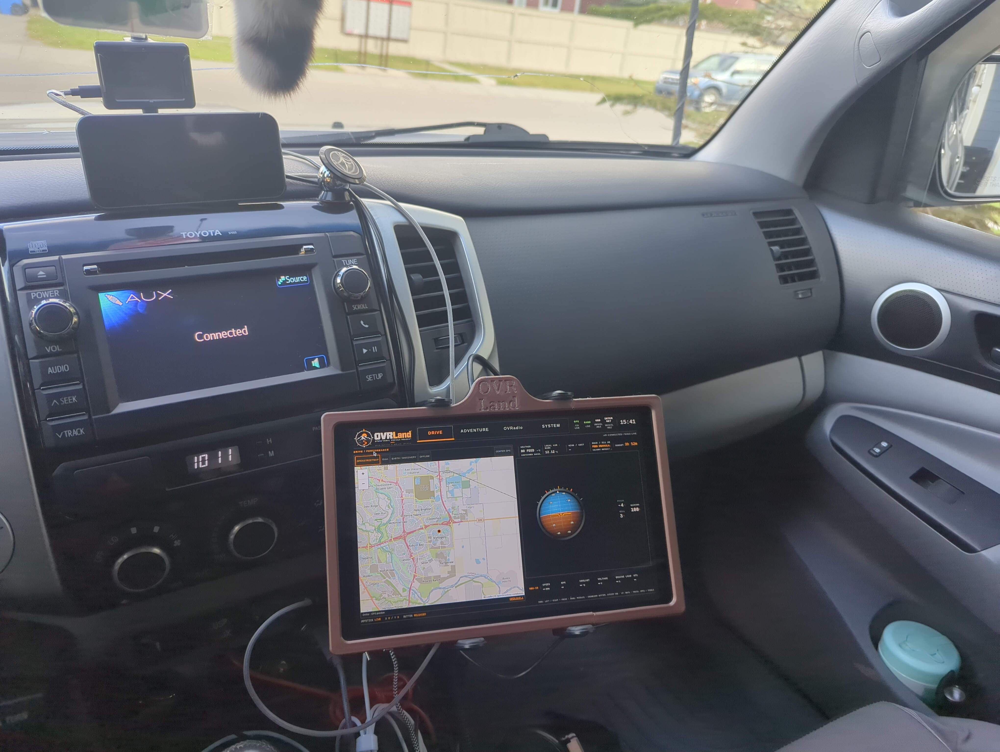

<p align="center">
  
</p>

# OVRLand
Operational Vehicle Readout — Location • Awareness • Navigation • Discovery.

“Rally-game HUD meets real overland instrument panel.”

OVRLand is a Raspberry Pi vehicle dashboard for overlanding, with live sensor
telemetry, GPS maps, weather and road conditions, internet radio, and trip
recording. Touch and joystick controls support Drive, Adventure, and Camp use.



[Download the wallpaper](media/OVRLandMediaKit/wallpapers/OVRLandOfficialWallpaper.png)
· [Explore the logo and media kit](media/OVRLandMediaKit/README.md)
· [Run the app](#run)

The app is in pre-beta development. GPS and recording are implemented; OBD and
route calculation are not. See the hardware and verification notes below before
setting up a vehicle installation.

## Demo screens

Captured from the actual app at 1280 × 800 in mock mode. Sensor, GPS, weather,
road, and vehicle readings are simulated; live OBD support is still planned.
The maps show the demo location, not the truck's position.

### Drive

Map, weather, vehicle attitude, and the vehicle readout in one dashboard.



<details>
<summary>Adventure — field instruments and location</summary>



</details>

<details>
<summary>OVRadio — music screen</summary>



Radio is idle in this capture. Spotify is an optional portal; its player is not configured.

</details>

Map attribution is retained in the screenshots: © OpenStreetMap contributors.

## In the truck



*An early OVRLand installation in the truck. The interface continues to evolve.*

## Run
Python/FastAPI + WebSocket + vanilla HTML/CSS/JS. No frontend build; map controls
and theme assets are bundled locally. Online map tiles require internet.

The joystick control foundation is deliberately limited to **X, Y, and center
click**—not mouse emulation or keyboard shortcuts. See the [control contract](docs/controls.md)
before adding a screen or control path.

```bash
git clone https://github.com/RawLabs/OVRLand.git
cd OVRLand
python3 -m venv .venv
.venv/bin/pip install -r requirements.lock.txt
scripts/validate.sh
# Live Nano bench test (default):
.venv/bin/uvicorn app:app --host 127.0.0.1 --port 8000 --no-proxy-headers
# Or mock layout preview (no hardware opened):
OVRLAND_MODE=mock .venv/bin/uvicorn app:app --host 127.0.0.1 --port 8000 --no-proxy-headers
```

Open http://127.0.0.1:8000 on the Pi. The service is deliberately loopback-only:
it is not exposed to passenger devices or the vehicle network. Stop-app and
Pi-poweroff controls require that direct loopback connection. Keep proxy headers
disabled and do not proxy these system endpoints: authorization relies on the
direct loopback peer. Until the optional kiosk setup below is installed, this is a
manually launched preview. Run one worker so only one adapter reads the serial
port. Close other serial monitors first.

The validation command runs Python compilation and unit tests, JavaScript
syntax and joystick hold tests, and shell syntax checks. CI runs it on Ubuntu
24.04 with Python 3.12 and the checked-in lockfile.

## Remote maintenance

For maintenance from a laptop or development phone when the Pi display is
unavailable, use SSH port forwarding rather than binding the dashboard to the
Ethernet or Wi-Fi network:

```bash
ssh -N -L 8000:127.0.0.1:8000 ovrld@10.42.0.2
```

Open http://127.0.0.1:8000 on the maintenance device. The SSH connection carries
the dashboard traffic to the Pi's local-only service, so all dashboard controls,
including the guarded system controls, retain their normal behavior.

## Full-screen startup on the Pi

The dashboard can start automatically with the Pi's graphical session as a
dedicated Chromium kiosk window. It runs the service only on `127.0.0.1`, so the
startup display is local to the Pi. From the repository root, install it once:

```bash
bash scripts/install_kiosk.sh
```

The dedicated OVRLand Chromium profile uses Chromium's basic local password
store. This avoids an `Unlock Login Keyring` prompt blocking kiosk startup on
Pi desktop sessions that use automatic login. OVRLand does not store website
passwords in this profile.

Keep this Chromium profile dedicated to OVRLand. Gaia and Earth / Discovery are
intentional map windows opened by the dashboard; use a separate browser for
ordinary internet use on the Pi.

This installs a per-user systemd service and desktop autostart entry; it does not
need `sudo` after installing the `wmctrl` system package (`sudo apt install wmctrl`).
Reboot or log out and back in to verify the boot flow. `Alt+F4` closes
the kiosk window for parked maintenance; it is deliberately not auto-restarted by
the desktop launcher. The **CAMP MODE** control in the System screen restores
OVRLand to a smaller, decorated desktop window; the same control then reads **FULL SCREEN**
and fills the display again. Both modes use the same Chromium window, so radio audio,
the dashboard connection, and recording continue through the transition. Choosing
**STOP APP** from the System screen also closes the OVRLand window and returns to the
desktop. The initial launch plays
`media/audio/voice/OVRLand-Start.wav` once. Moving between Camp Mode and full
screen does not replay the startup voice. Window mode changes do not show a
warning overlay or play an exit voice.

To remove the startup setup, run:

```bash
bash scripts/install_kiosk.sh remove
```

After **STOP APP** closes the kiosk, relaunch OVRLand from the desktop
application menu entry named **OVRLand**. The entry starts the user service and
opens the dashboard.

If a kiosk session ever prevents normal desktop use, press `Ctrl+Alt+F2`, sign
in at the text console, run the removal command above from the repository, then
run `sudo reboot`. This removes only OVRLand's per-user service and autostart
entry; it does not alter the Pi desktop configuration.

## Live bench test
- Nano temperature, humidity, pressure, barometric altitude estimate, raw RGB light,
  joystick, and accelerometer pitch/roll feed the common telemetry API.
- Tilt is an **uncalibrated static gravity estimate**, affected by acceleration.
  The Nano is mounted on its side; the adapter rotates its axes into vehicle
  coordinates (forward=Z, right=X, up=-Y). Positive pitch means nose up; positive
  roll means right side up. The Tilt-Oh-Shit meter shows an amber visual caution
  at 20° and a red visual alarm at 30° of displayed pitch or roll. These are
  driver-reference bands only, not validated rollover limits, and there is no
  vehicle control output, fused yaw, or heading.
  The Vehicle Attitude detail can save the current position as a persistent
  display-level offset; the raw accelerometer telemetry remains unchanged.
- Barometric altitude comes from firmware and its pressure reference; it is not GPS
  altitude. APDS RGB counts are raw values, not lux or a daylight classification.
- In **System**, use **Capture Day**, **Capture Dusk**, and **Capture Night** while
  the sensor is exposed to the actual vehicle lighting. Each tap records raw RGB
  counts and relative brightness in `config/ambient_light_calibration.json`; the
  saved references are for setting vehicle-specific night thresholds later and do
  not yet alter the display theme or brightness.
- Joystick left/right moves the white focus outline across the mode tabs. Press
  activates the highlighted tab. Down enters the dashboard; all four directions
  then move focus to the nearest module in that direction. Up at the top edge
  returns to the tabs; Down at the bottom edge focuses the System tab. Press opens the
  focused module detail. Modules and buttons also respond directly to touch.
  Every expanded module has a visible `BACK TO DASHBOARD` action; expanded Map
  uses its own touch controls and joystick control row. Return to center between
  joystick moves. X/Y and button state are visible below the panes.
  Mode selections are local to each visible browser; only the front display should
  use this bench control path. A separate rear-display role remains future work.
- The System tab's ambient capture, recording, export, window-mode, and shutdown
  controls are all joystick reachable and directly touchable. STOP APP and POWER
  OFF PI require a continuous two-second hold. Mock mode simulates shutdown
  actions without changing the host.
- The Music screen plays the curated internet radio stations directly in the
  browser, with no local player daemon or installation needed. OVRadio stays idle
  until a station is selected; the joystick detail offers station selection,
  previous/next station, play/pause, volume, and stop. Presets live in
  `config/radio_presets.json`; browser playback uses a direct audio URL so it
  does not need to resolve M3U/PLS playlist files. Open Road uses MP3 for wider
  browser compatibility. Current song metadata refreshes every 15 seconds from
  provider feeds when available. Spotify remains a separate optional portal;
  local music/video remains deferred.
- Invalid JSON is dropped. After two seconds without valid Nano data, values clear.
  Unplug/replug is retried. Joystick requires neutral/release after reconnect; old
  control events are not replayed on browser connection. No serial commands sent.
- GPS connects to a system-owned gpsd on `127.0.0.1:2947`, reconnects after
  disconnects, and remains unavailable rather than substituting demo values when
  gpsd or a valid fix is absent. OBD remains unavailable in live mode.
- Internet status checks a short TCP connection to `1.1.1.1:443` every 15 seconds
  and reports `CONNECTED` or `UNAVAILABLE` in the source strip. Override the
  check target with `OVRLAND_NETWORK_CHECK_HOST` and
  `OVRLAND_NETWORK_CHECK_PORT` when the vehicle network requires another route.
- Weather comes from Open-Meteo, refreshed every 15 minutes. It follows a live
  GPS fix when available, then uses the last valid GPS position if the fix is lost
  or the app restarts. The last position is saved at
  `~/.local/state/ovrland/last_gps_location.json`; set `OVRLAND_LAST_GPS_FILE`
  to use another path. Before the first valid fix, weather uses the configured
  fallback coordinates (51.04, -114.07 by default). Set `OVRLAND_WEATHER_LATITUDE`
  and `OVRLAND_WEATHER_LONGITUDE` to change them. Set
  `OVRLAND_DEFAULT_LOCATION_NAME` to name that configured location in the UI.
  Road conditions come
  from the nearest 511 Alberta winter-road report within 35 km and refresh every
  five minutes. 511 requires a developer key; store it in
  `~/.config/ovrland/ovrland.env` as `OVRLAND_511_API_KEY=...`, then restart the
  user service. Without a key, the screen says `KEY REQUIRED`. Weather feed
  values are kept separate from Nano local-air sensor readings.
  For 511 troubleshooting, `/api/telemetry` includes
  `road_conditions.diagnostics`: worker activity, fetch phase, attempt/failure
  counts, discarded results, last attempt and successful fetch times, fetch
  duration, the next scheduled attempt, and a safe error category/HTTP status.
  `updated_at` identifies the last published result; a successful fetch can
  still be discarded if the location source changes or movement exceeds the
  refresh threshold during the request. Small GPS changes within that threshold
  no longer discard usable reports. Failed requests retry after 60 seconds;
  the display gives a short failure reason and service logs record failures
  and discarded responses without request URLs or API keys. Inspect logs with
  `systemctl --user status ovrland.service` or
  `journalctl --user -u ovrland.service` where journal history is available.
- **RECORD** writes the complete telemetry snapshot to a local JSON Lines log at
  5 Hz, independently of the browser connection. Press it again to stop; app
  shutdown closes an active log. Logs are stored in
  `~/.local/state/ovrland/recordings` by default; set `OVRLAND_RECORDING_DIR` to
  choose another directory. **LATEST LOG** and **LATEST GPS TRACK** export the
  active or most recent session. **ALL LOGS · ZIP** downloads every saved log
  together, including a consistent snapshot of an active log. No automatic log
  deletion or upload is configured. System shows elapsed time, distance, moving
  time, GPS fix count, and last fix for the active or most recent log. Distance
  and moving time use distinct live GPS fixes and are estimates; gaps and
  implausible jumps are excluded. Map controls support online OSM and installed
  offline packages. The recorder fsyncs at least every five seconds and on a
  clean stop. It refuses to start with less than 256 MiB free and stops when
  that reserve is reached. Set `OVRLAND_RECORDING_MIN_FREE_BYTES` to change the
  reserve. Logs are never silently removed; copy or export them for maintenance.

Override `OVRLAND_NANO_DEVICE` to choose another serial device. Default:
`/dev/serial/by-id/usb-Arduino_Nano_33_BLE_6645321B7A5D0D0F-if00`.

## Pi GPS setup and smoke test

Install and enable gpsd on Raspberry Pi OS, configuring it for the stable
`/dev/serial/by-id/...` receiver path when one is available:

```bash
sudo apt update
sudo apt install gpsd gpsd-clients
gpspipe -w -n 20
```

OVRLand is a gpsd client and does not open the receiver or launch/terminate gpsd.
It consumes TPV and SKY reports, requires `mode >= 2` plus latitude/longitude,
and exposes satellite counts and approximate accuracy in the telemetry `gps`
metadata. The dashboard and Center GPS map control update when a valid fix arrives.

For direct serial troubleshooting while gpsd is stopped, the older read-only NMEA
checker remains available:

```bash
.venv/bin/pip install -r requirements.txt
.venv/bin/python scripts/check_gps.py --seconds 30
```

It checks `/dev/serial/by-id/*`, `/dev/ttyUSB*`, and `/dev/ttyACM*`, validates NMEA
checksums, and reports latitude, longitude, fix quality, satellites, altitude,
speed, and heading. A fix normally requires a view of the sky; indoors it may
report valid NMEA sentences but zero position fixes. If permission is denied, add
the Pi user to the serial-device group (`sudo usermod -aG dialout "$USER"`) and
log in again. The checker does not start or change the dashboard and sends no
serial commands.

## Boundaries and contract
`adapters/nano.py` owns serial IO and normalization; `app.py` owns the common
snapshot and API; the browser never opens hardware. Future sources get independent
adapters. `GET /api/telemetry` and `/ws/telemetry` share schema version 1, with units
in field names. The socket sends snapshots at 5 Hz; that is not a claim about sensor
sampling rate. Source status and Nano sample age/receive timestamp identify freshness.
Only the latest sample and a bounded 20-event joystick history are kept in memory.
In mock mode, `static/mock.json` supplies stable, explicitly simulated readings.

## Verification

```bash
.venv/bin/python -m unittest discover -s tests -v
node --check static/app.js
node --check static/maps.js
node --check static/navball.js
```

For a fresh installation, use `scripts/validate.sh` after installing the
checked-in lockfile. It runs the Python suite, Python compilation, JavaScript
syntax and joystick hold checks, and shell syntax checks. Node.js is a
development check tool; the dashboard runs in Chromium and the service runs in
Python.

The pre-beta review records current code repairs, automated evidence, the
dependency advisory scan, and the remaining target-device gate in
[docs/pre-beta-health-check.md](docs/pre-beta-health-check.md). Browser viewport,
physical joystick and sensor behavior, cold boot, long recording soak, and
controlled power-loss durability still require the target display and hardware.

GPS and recording are implemented; OBD, gyro and magnetometer calibration remain
future work. See [scope and references](docs/scope.md),
[checkpoint status](docs/status.md), and [hardware setup](docs/hardware.md).

## Dashboards and maps
Drive and Adventure are separate dashboards styled from the supplied OVRLand
logo/theme references. Drive uses round performance gauges; Adventure emphasizes
the map, field conditions, and larger orientation instruments. System provides guarded stop-app and Pi-poweroff controls. Unknown readings remain blank.
The conditions detail shows the nearest 511 road report's road, location,
distance, reported time, and secondary conditions when available. The weather
strip summarizes precipitation chance, gusts, and low visibility over the next
three forecast hours. Feed age and stale status remain visible when updates fail.

The map source buttons select **OpenStreetMap**, **Gaia**, **Earth / Discovery**,
or **Offline**. OSM is
an interactive online map; Center GPS uses telemetry when coordinates are valid.
The initial browse view follows the region in the supplied Gaia link; it is not a
claimed vehicle location. Gaia opens that link in its own browser tab for sign-in.
Earth / Discovery opens the free Google Earth web app in a touch-capable Chromium
popup sized to cover the dashboard map panel; it needs internet and is not embedded
or billed through Google Maps Platform. Gaia's mobile offline downloads do not make
its website work offline.

Offline uses a raster MBTiles package stored on the Pi. No package is installed
by default. See [offline map setup](maps/README.md). Leaflet 1.9.4 is bundled locally
(with its license and official JS/CSS checksums verified), so offline map controls
do not require a CDN. OSM tiles are not prefetched or bulk-downloaded. No route
calculation is implemented by these map controls.

## License

OVRLand's source code and documentation are licensed under the [MIT License](LICENSE).
Copyright (c) 2026 RawLabs.

Images and audio under `media/`, plus `static/assets/brand-reference.png`, are
covered separately by the [artwork and media terms](ASSET-LICENSE.md). These
terms allow the assets to ship with OVRLand and clearly identified unofficial
versions, while reserving standalone reuse and branding rights. CSS, JSON, and
Markdown files in `media/`, and `static/assets/contours.svg`, remain under MIT.

Third-party components retain their own licenses, including the bundled
[Leaflet BSD 2-Clause license](static/vendor/leaflet/LICENSE). External map,
weather, and radio services retain their own terms; the repository licenses do
not grant rights to their content.
